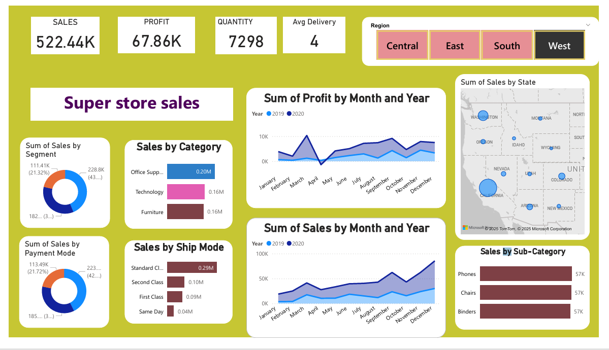

# Sales_data_dashboard
This is the dashboard that I have created.

## 📁 Project Description:  
This project showcases a Sales Dashboard created using Microsoft Power BI.  
It provides insights into sales performance across  
- regions  
- products  
- payment mode  
- ship mode  
- time periods  
to help stakeholders make data-driven decisions.
## 📈 Dashboard Features
- Total Sales Overview
- Monthly & Yearly Sales Trends
- Top Performing Products
- Regional Sales Comparison
- KPI Cards for quick metrics
- Interactive filters and slicers

## 🚀 How to Use

1. Download or clone this repository  
2. Open `sales_forcast .pbix` in Power BI Desktop  
3. Refresh the data if needed  
4. Explore the dashboard interactively
